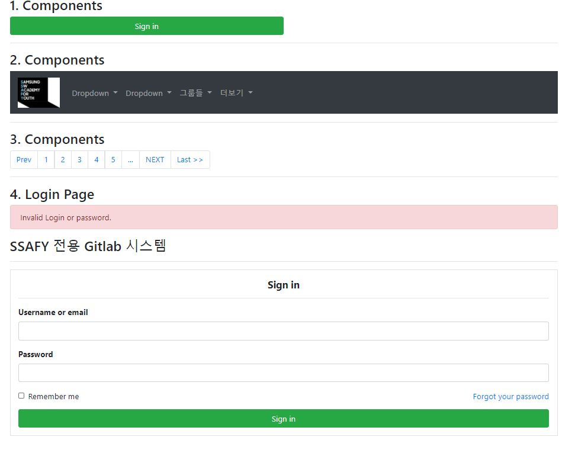

# 0812 Homework

```html
<!DOCTYPE html>
<html lang="en">
<head>
    <meta charset="UTF-8">
    <meta name="viewport" content="width=device-width, initial-scale=1.0">
    <!-- bootstrap css cdn -->
    <link rel="stylesheet" href="https://stackpath.bootstrapcdn.com/bootstrap/4.5.2/css/bootstrap.min.css" integrity="sha384-JcKb8q3iqJ61gNV9KGb8thSsNjpSL0n8PARn9HuZOnIxN0hoP+VmmDGMN5t9UJ0Z" crossorigin="anonymous">
    <title>Document</title>

</head>
<body>
    <div class="container">
        <h3> 1. Components</h3>
        <button type="button" class="btn btn-success w-50">Sign in</button>
        <hr>

        <h3> 2. Components</h3>
        <nav class="navbar navbar-expand-lg navbar-dark bg-dark">
            <a class="navbar-brand" href="#">
                
            </a>
            <button class="navbar-toggler" type="button" data-toggle="collapse" data-target="#navbarSupportedContent" aria-controls="navbarSupportedContent" aria-expanded="false" aria-label="Toggle navigation">
              <span class="navbar-toggler-icon"></span>
            </button>
          
            <div class="collapse navbar-collapse" id="navbarSupportedContent">
              <ul class="navbar-nav mr-auto">
                <li class="nav-item dropdown">
                  <a class="nav-link dropdown-toggle" href="https://www.ssafy.com/swp_m/images/common/logo3.png" id="navbarDropdown" role="button" data-toggle="dropdown" aria-haspopup="true" aria-expanded="false">
                    Dropdown
                  </a>
                  <div class="dropdown-menu" aria-labelledby="navbarDropdown">
                    <a class="dropdown-item" href="#">Action</a>
                    <a class="dropdown-item" href="#">Another action</a>
                    <div class="dropdown-divider"></div>
                    <a class="dropdown-item" href="#">Something else here</a>
                  </div>
                </li>
                <li class="nav-item dropdown">
                  <a class="nav-link dropdown-toggle" href="#" id="navbarDropdown" role="button" data-toggle="dropdown" aria-haspopup="true" aria-expanded="false">
                    Dropdown
                  </a>
                  <div class="dropdown-menu" aria-labelledby="navbarDropdown">
                    <a class="dropdown-item" href="#">Action</a>
                    <a class="dropdown-item" href="#">Another action</a>
                    <div class="dropdown-divider"></div>
                    <a class="dropdown-item" href="#">Something else here</a>
                  </div>
                </li>
                <li class="nav-item dropdown">
                  <a class="nav-link dropdown-toggle" href="#" id="navbarDropdown" role="button" data-toggle="dropdown" aria-haspopup="true" aria-expanded="false">
                    그룹들
                  </a>
                  <div class="dropdown-menu" aria-labelledby="navbarDropdown">
                    <a class="dropdown-item" href="#">Action</a>
                    <a class="dropdown-item" href="#">Another action</a>
                    <div class="dropdown-divider"></div>
                    <a class="dropdown-item" href="#">Something else here</a>
                  </div>
                </li>
                <li class="nav-item dropdown">
                  <a class="nav-link dropdown-toggle" href="#" id="navbarDropdown" role="button" data-toggle="dropdown" aria-haspopup="true" aria-expanded="false">
                    더보기
                  </a>
                  <div class="dropdown-menu" aria-labelledby="navbarDropdown">
                    <a class="dropdown-item" href="#">Action</a>
                    <a class="dropdown-item" href="#">Another action</a>
                    <div class="dropdown-divider"></div>
                    <a class="dropdown-item" href="#">Something else here</a>
                  </div>
                </li>
        </nav>
        <hr>

        <h3> 3. Components </h3>
        <nav aria-label="Page navigation example">
            <ul class="pagination">
              <li class="page-item">
                <a class="page-link" href="#" aria-label="Previous">
                  Prev
                </a>
              </li>
              <li class="page-item"><a class="page-link" href="#">1</a></li>
              <li class="page-item"><a class="page-link" href="#">2</a></li>
              <li class="page-item"><a class="page-link" href="#">3</a></li>
              <li class="page-item"><a class="page-link" href="#">4</a></li>
              <li class="page-item"><a class="page-link" href="#">5</a></li>
              <li class="page-item"><a class="page-link" href="#">...</a></li>
              <li class="page-item">
                <a class="page-link" href="#" aria-label="Next">
                  NEXT
                </a>
              </li>
              <li class="page-item">
                <a class="page-link" href="#" aria-label="Next">
                  Last >>
                </a>
              </li>
            </ul>
          </nav>
        <hr>

        <h3> 4. Login Page </h3>
        <div class="alert alert-danger" role="alert">
            Invalid Login or password.
          </div>
          <h3>SSAFY 전용 Gitlab 시스템</h3>
          <hr class="success">
          <form class="p-3 border">
            <h5 class="text-center font-weight-bold">Sign in</h5>
            <hr>
            <div class="form-group font-weight-bold">
              <label for="exampleInputEmail1">Username or email</label>
              <input type="email" class="form-control" id="exampleInputEmail1" aria-describedby="emailHelp">
            </div>
            <div class="form-group font-weight-bold">
              <label for="exampleInputPassword1">Password</label>
              <input type="password" class="form-control" id="exampleInputPassword1">
            </div>
            <div class="d-flex justify-content-between">
                <div class="form-group form-check">
                    <input type="checkbox" class="form-check-input" id="exampleCheck1">
                    <label class="form-check-label" for="exampleCheck1">Remember me</label>
                  </div>
                  <div>
                      <a href="#">Forgot your password</a>
                  </div>
            </div>
            <button type="submit" class="btn btn-success w-100">Sign in</button>
          </form>
    </div>

    <!-- bootstrap js cdn -->
    <script src="https://code.jquery.com/jquery-3.5.1.slim.min.js" integrity="sha384-DfXdz2htPH0lsSSs5nCTpuj/zy4C+OGpamoFVy38MVBnE+IbbVYUew+OrCXaRkfj" crossorigin="anonymous"></script>
    <script src="https://cdn.jsdelivr.net/npm/popper.js@1.16.1/dist/umd/popper.min.js" integrity="sha384-9/reFTGAW83EW2RDu2S0VKaIzap3H66lZH81PoYlFhbGU+6BZp6G7niu735Sk7lN" crossorigin="anonymous"></script>
    <script src="https://stackpath.bootstrapcdn.com/bootstrap/4.5.2/js/bootstrap.min.js" integrity="sha384-B4gt1jrGC7Jh4AgTPSdUtOBvfO8shuf57BaghqFfPlYxofvL8/KUEfYiJOMMV+rV" crossorigin="anonymous"></script>
</body>
</html>

```

