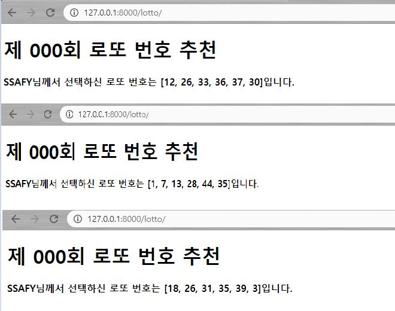

# 0814 Workshop

## Django Project

- ####  intro/urls.py

```python
"""first_project URL Configuration

The `urlpatterns` list routes URLs to views. For more information please see:
    https://docs.djangoproject.com/en/3.1/topics/http/urls/
Examples:
Function views
    1. Add an import:  from my_app import views
    2. Add a URL to urlpatterns:  path('', views.home, name='home')
Class-based views
    1. Add an import:  from other_app.views import Home
    2. Add a URL to urlpatterns:  path('', Home.as_view(), name='home')
Including another URLconf
    1. Import the include() function: from django.urls import include, path
    2. Add a URL to urlpatterns:  path('blog/', include('blog.urls'))
"""
from django.contrib import admin
from django.urls import path
from articles import views

urlpatterns = [
    path('lotto/',views.lotto),
]
```


- #### pages/views.py

```python
import random
import datetime
from django.shortcuts import render

def lotto(request):
    numbers=list(range(1,46))
    numbers1=random.sample(numbers,5)
    numbers2=random.choice(list(set(numbers)-set(numbers1)))
    numbers1=sorted(numbers1)
    numbers1.append(numbers2)
    context={
        'ans':numbers1
    }
    return render(request,'lotto.html',context)
```


- #### templates/lotto.html

```html
<!DOCTYPE html>
<html lang="en">
<head>
    <meta charset="UTF-8">
    <meta name="viewport" content="width=device-width, initial-scale=1.0">
    <title>Document</title>
</head>
<body>
    <h1>제 000회 로또 번호 추천</h1>
    <h4>SSAFY님께서 선택하신 로또 번호는 {{ans}}입니다.</h4>
</body>
</html>
```


