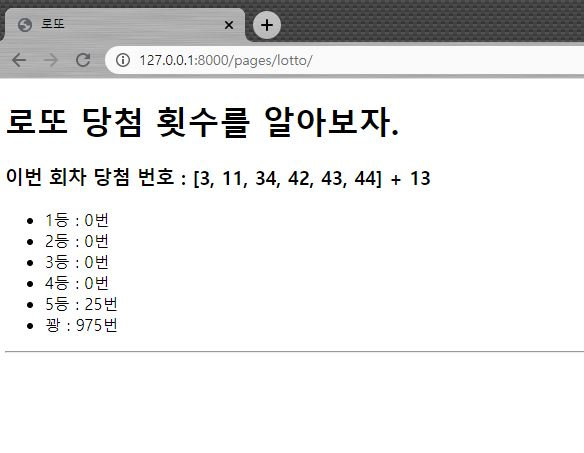

# 0818_Practice

## Open API & 3rd Party Library 사용

- **intro/urls.py**

```python
from django.contrib import admin
from django.urls import path, include

urlpatterns = [
    path('admin/', admin.site.urls),
    path('pages/', include('pages.urls'))
]

```


- **pages/views.py**

```python
from django.shortcuts import render

# Create your views here.
from django.shortcuts import render
import random
import requests
# Create your views here.


def lotto(request):
    url1='https://www.dhlottery.co.kr/common.do?method=getLottoNumber&drwNo='
    #로또 회차
    l_round=924
    url=url1+str(l_round)
    response=requests.get(url)
    data=response.json()
    winning=[]
    for i in range(1,7):
        winning.append(data.get('drwtNo'+str(i)))
    winning.sort()
    bonus=data.get('bnusNo')
    ans=[]    
    for _ in range(1000):    
        num_range=list(range(1,46))
        numb=random.sample(list(range(1,46)),6)
        numb.sort()
        num2=list(set(num_range)-set(numb))
        made_bonus=random.choice(num2)
        
        num_winning=len(list(set(winning) & set(numb)))
        
    
        if num_winning==6:
            ans.append(1)
        elif num_winning==5 and bonus==made_bonus:
            ans.append(2)
        elif num_winning==5:
            ans.append(3)
        elif num_winning==4:
            ans.append(4)
        elif num_winning==3:
            ans.append(5)
        else:
            ans.append(6)
    
    w1=ans.count(1)
    w2=ans.count(2)
    w3=ans.count(3)
    w4=ans.count(4)
    w5=ans.count(5)
    w6=ans.count(6)
    context={
        'winning':winning,
        'bonus':bonus,
        'w1': w1,
        'w2': w2,
        'w3': w3,
        'w4': w4,
        'w5': w5,
        'w6': w6,
    }
    return render(request, 'pages/lotto.html', context)

```


- **templates/lotto.html**

```html
<!DOCTYPE html>
<html lang="en">
<head>
    <meta charset="UTF-8">
    <meta name="viewport" content="width=device-width, initial-scale=1.0">
    <title>로또</title>
    <h1>로또 당첨 횟수를 알아보자.</h1>
</head>
<body>
    <h3>이번 회차 당첨 번호 : {{ winning }} + {{ bonus }}</h3>
    <ul>
        <li>1등 : {{ w1 }}번</li>
        <li>2등 : {{ w2 }}번</li>
        <li>3등 : {{ w3 }}번</li>
        <li>4등 : {{ w4 }}번</li>
        <li>5등 : {{ w5 }}번</li>
        <li>꽝 : {{ w6 }}번</li>
    </ul>
     <hr>
    <ul>
      
        <li>{{key}} : {{val}}번</li>
      
    </ul> 
</body>
</html>
```


- **pages/urls.py**

```python
from django.urls import path
from . import views


app_name='pages'
urlpatterns = [
    path('lotto/', views.lotto, name='lotto')
]

```

