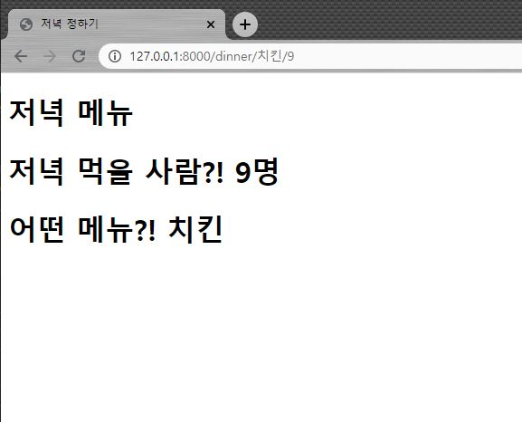

# 0818_Workshop

## Variable Routing

- **intro/urls.py**

```python
from django.contrib import admin
from django.urls import path
from pages import views

urlpatterns = [
    path('admin/', admin.site.urls),
    path('dinner/<str:name>/<int:number>', views.dinner, name='dinner')
]

```


- **pages/views.py**

```python
from django.shortcuts import render

# Create your views here.
def dinner(request, name, number):
    context={
        'number':number,
        'name':name,
    }
    return render(request,'dinner/dinner.html',context)
```


- **templates/dinner.html**

```html
<!DOCTYPE html>
<html lang="en">
<head>
    <meta charset="UTF-8">
    <meta name="viewport" content="width=device-width, initial-scale=1.0">
    <title>저녁 정하기</title>
</head>
<body>
    <h1>저녁 메뉴</h1>
    <h1>저녁 먹을 사람?! {{number}}명</h1>
    <h1>어떤 메뉴?! {{name}}</h1>
</body>
</html>
```

