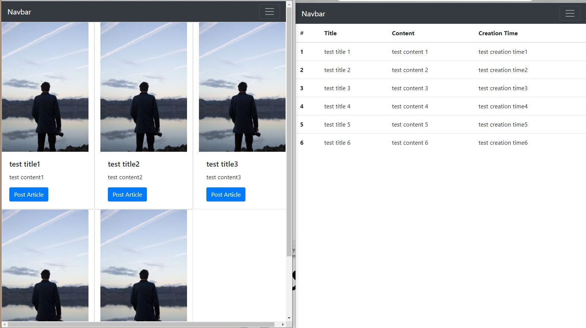

# 0819_Workshop

### 1. intro/settings.py

```python
"""
Django settings for intro project.

Generated by 'django-admin startproject' using Django 3.1.

For more information on this file, see
https://docs.djangoproject.com/en/3.1/topics/settings/

For the full list of settings and their values, see
https://docs.djangoproject.com/en/3.1/ref/settings/
"""

from pathlib import Path

# Build paths inside the project like this: BASE_DIR / 'subdir'.
BASE_DIR = Path(__file__).resolve(strict=True).parent.parent


# Quick-start development settings - unsuitable for production
# See https://docs.djangoproject.com/en/3.1/howto/deployment/checklist/

# SECURITY WARNING: keep the secret key used in production secret!
SECRET_KEY = '2si9aj&5=m7nir74l%*yfy(4@a+ccsdbj*q2je2$lsnrdmlh+m'

# SECURITY WARNING: don't run with debug turned on in production!
DEBUG = True

ALLOWED_HOSTS = []


# Application definition

INSTALLED_APPS = [
    'pages',
    'django.contrib.admin',
    'django.contrib.auth',
    'django.contrib.contenttypes',
    'django.contrib.sessions',
    'django.contrib.messages',
    'django.contrib.staticfiles',
]

MIDDLEWARE = [
    'django.middleware.security.SecurityMiddleware',
    'django.contrib.sessions.middleware.SessionMiddleware',
    'django.middleware.common.CommonMiddleware',
    'django.middleware.csrf.CsrfViewMiddleware',
    'django.contrib.auth.middleware.AuthenticationMiddleware',
    'django.contrib.messages.middleware.MessageMiddleware',
    'django.middleware.clickjacking.XFrameOptionsMiddleware',
]

ROOT_URLCONF = 'intro.urls'

TEMPLATES = [
    {
        'BACKEND': 'django.template.backends.django.DjangoTemplates',
        'DIRS': [BASE_DIR / 'intro' / 'templates'],
        'APP_DIRS': True,
        'OPTIONS': {
            'context_processors': [
                'django.template.context_processors.debug',
                'django.template.context_processors.request',
                'django.contrib.auth.context_processors.auth',
                'django.contrib.messages.context_processors.messages',
            ],
        },
    },
]

WSGI_APPLICATION = 'intro.wsgi.application'


# Database
# https://docs.djangoproject.com/en/3.1/ref/settings/#databases

DATABASES = {
    'default': {
        'ENGINE': 'django.db.backends.sqlite3',
        'NAME': BASE_DIR / 'db.sqlite3',
    }
}


# Password validation
# https://docs.djangoproject.com/en/3.1/ref/settings/#auth-password-validators

AUTH_PASSWORD_VALIDATORS = [
    {
        'NAME': 'django.contrib.auth.password_validation.UserAttributeSimilarityValidator',
    },
    {
        'NAME': 'django.contrib.auth.password_validation.MinimumLengthValidator',
    },
    {
        'NAME': 'django.contrib.auth.password_validation.CommonPasswordValidator',
    },
    {
        'NAME': 'django.contrib.auth.password_validation.NumericPasswordValidator',
    },
]


# Internationalization
# https://docs.djangoproject.com/en/3.1/topics/i18n/

LANGUAGE_CODE = 'ko-kr'

TIME_ZONE = 'Asia/Seoul'

USE_I18N = True

USE_L10N = True

USE_TZ = True


# Static files (CSS, JavaScript, Images)
# https://docs.djangoproject.com/en/3.1/howto/static-files/

STATIC_URL = '/static/'

```

### 2. intro/urls.py

```python
"""intro URL Configuration

The `urlpatterns` list routes URLs to views. For more information please see:
    https://docs.djangoproject.com/en/3.1/topics/http/urls/
Examples:
Function views
    1. Add an import:  from my_app import views
    2. Add a URL to urlpatterns:  path('', views.home, name='home')
Class-based views
    1. Add an import:  from other_app.views import Home
    2. Add a URL to urlpatterns:  path('', Home.as_view(), name='home')
Including another URLconf
    1. Import the include() function: from django.urls import include, path
    2. Add a URL to urlpatterns:  path('blog/', include('blog.urls'))
"""
from django.contrib import admin
from django.urls import path, include

urlpatterns = [
    path('admin/', admin.site.urls),
    path('pages/', include('pages.urls'))
]

```
### 3.pages/urls.py

```python
from django.urls import path
from . import views


app_name='pages'
urlpatterns = [
    path('card/', views.card, name='card'),
    path('community/', views.community, name='community'),
]

```


### 3. pages/views.py

```python
from django.shortcuts import render

# Create your views here.
def card(request):
    articles=[
        ['test title1','test content1'],
        ['test title2','test content2'],
        ['test title3','test content3'],
        ['test title4','test content4'],
        ['test title5','test content5']
    ]
    context={
        'articles':articles
    }
    return render(request, 'pages/card.html', context)


def community(request):
    articles = [
        ['#', 'Title', 'Content', 'Creation Time'],
        ['test title 1', 'test content 1', 'test creation time1'],
        ['test title 2', 'test content 2', 'test creation time2'],
        ['test title 3', 'test content 3', 'test creation time3'],
        ['test title 4', 'test content 4', 'test creation time4'],
        ['test title 5', 'test content 5', 'test creation time5'],
        ['test title 6', 'test content 6', 'test creation time6'],
    ]
    context={
        'articles':articles,
    }
    return render(request, 'pages/community.html', context)
```


### 4. intro/templates/base.html

```html
<!DOCTYPE html>
<html lang="en">
<head>
  <meta charset="UTF-8">
  <meta name="viewport" content="width=device-width, initial-scale=1.0">
  <link rel="stylesheet" href="https://stackpath.bootstrapcdn.com/bootstrap/4.5.2/css/bootstrap.min.css" integrity="sha384-JcKb8q3iqJ61gNV9KGb8thSsNjpSL0n8PARn9HuZOnIxN0hoP+VmmDGMN5t9UJ0Z" crossorigin="anonymous">
  <title>
    
      Django Project
    
  </title>
</head>
<body>
  <nav class="navbar navbar-expand-lg navbar-dark bg-dark">
  <a class="navbar-brand" href="#">Navbar</a>
  <button class="navbar-toggler" type="button" data-toggle="collapse" data-target="#navbarNav" aria-controls="navbarNav" aria-expanded="false" aria-label="Toggle navigation">
    <span class="navbar-toggler-icon"></span>
  </button>
  <div class="collapse navbar-collapse justify-content-end" id="navbarNav">
    <ul class="navbar-nav">
      <li class="nav-item active">
        <a class="nav-link" href="">Card</a>
      </li>
      <li class="nav-item">
        <a class="nav-link" href="">Community</a>
      </li>
    </ul>
  </div>
</nav>
  
    <h2>자식 content</h2>
  


  <script src="https://code.jquery.com/jquery-3.5.1.slim.min.js" integrity="sha384-DfXdz2htPH0lsSSs5nCTpuj/zy4C+OGpamoFVy38MVBnE+IbbVYUew+OrCXaRkfj" crossorigin="anonymous"></script>
  <script src="https://cdn.jsdelivr.net/npm/popper.js@1.16.1/dist/umd/popper.min.js" integrity="sha384-9/reFTGAW83EW2RDu2S0VKaIzap3H66lZH81PoYlFhbGU+6BZp6G7niu735Sk7lN" crossorigin="anonymous"></script>
  <script src="https://stackpath.bootstrapcdn.com/bootstrap/4.5.2/js/bootstrap.min.js" integrity="sha384-B4gt1jrGC7Jh4AgTPSdUtOBvfO8shuf57BaghqFfPlYxofvL8/KUEfYiJOMMV+rV" crossorigin="anonymous"></script>
</body>
</html>
```

### 5. pages/templates/card.html

```html



<div class='row'>
  
    <div class="card col-4" style="width: 18rem;">
      
      <div class="card-body">
        <h5 class="card-title">{{article.0}}</h5>
        <p class="card-text">{{article.1}}</p>
        <a href="#" class="btn btn-primary">Post Article</a>
      </div>
    </div>
  
</div>

```

### 6. pages/templates/community.html

```html



<table class="table">
  <thead>
    <tr>
      <th scope="col">{{articles.0.0}}</th>
      <th scope="col">{{articles.0.1}}</th>
      <th scope="col">{{articles.0.2}}</th>
      <th scope="col">{{articles.0.3}}</th>
    </tr>
  </thead>
  <tbody>
    
      
        <tr>
        <th scope="row">{{forloop.counter0}}</th>
        <td>{{article.0}}</td>
        <td>{{article.1}}</td>
        <td>{{article.2}}</td>
        </tr>
      
    
  </tbody>
</table>

```

