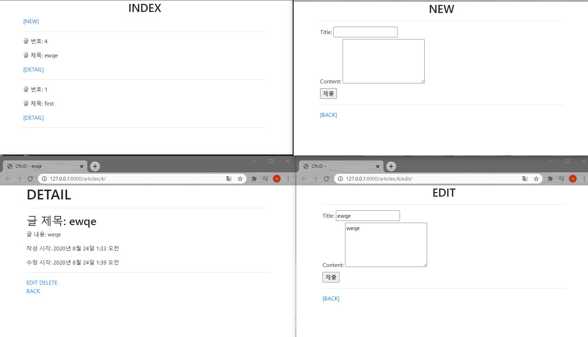

# 0820_ workshop

### crud/template/base.html

```html
<!DOCTYPE html>
<html lang="en">
<head>
  <meta charset="UTF-8">
  <meta name="viewport" content="width=device-width, initial-scale=1.0">
  <!-- Bootstrap CSS -->
  <link rel="stylesheet" href="https://stackpath.bootstrapcdn.com/bootstrap/4.5.2/css/bootstrap.min.css" integrity="sha384-JcKb8q3iqJ61gNV9KGb8thSsNjpSL0n8PARn9HuZOnIxN0hoP+VmmDGMN5t9UJ0Z" crossorigin="anonymous">
  <title>
    CRUD - 
    
    
  </title>
</head>
<body>
  <div class="container">
    
    
  </div>

  <!-- Bootstrap JS -->
  <script src="https://code.jquery.com/jquery-3.5.1.slim.min.js" integrity="sha384-DfXdz2htPH0lsSSs5nCTpuj/zy4C+OGpamoFVy38MVBnE+IbbVYUew+OrCXaRkfj" crossorigin="anonymous"></script>
  <script src="https://cdn.jsdelivr.net/npm/popper.js@1.16.1/dist/umd/popper.min.js" integrity="sha384-9/reFTGAW83EW2RDu2S0VKaIzap3H66lZH81PoYlFhbGU+6BZp6G7niu735Sk7lN" crossorigin="anonymous"></script>
  <script src="https://stackpath.bootstrapcdn.com/bootstrap/4.5.2/js/bootstrap.min.js" integrity="sha384-B4gt1jrGC7Jh4AgTPSdUtOBvfO8shuf57BaghqFfPlYxofvL8/KUEfYiJOMMV+rV" crossorigin="anonymous"></script>
</body>
</html>
```


### crud/urls.py

```python
"""crud URL Configuration

The `urlpatterns` list routes URLs to views. For more information please see:
    https://docs.djangoproject.com/en/3.1/topics/http/urls/
Examples:
Function views
    1. Add an import:  from my_app import views
    2. Add a URL to urlpatterns:  path('', views.home, name='home')
Class-based views
    1. Add an import:  from other_app.views import Home
    2. Add a URL to urlpatterns:  path('', Home.as_view(), name='home')
Including another URLconf
    1. Import the include() function: from django.urls import include, path
    2. Add a URL to urlpatterns:  path('blog/', include('blog.urls'))
"""
from django.contrib import admin
from django.urls import path, include

urlpatterns = [
    path('admin/', admin.site.urls),
    # 'articles/'로 시작하는 URL은 articles 앱의 urls.py에서 처리하도록 위임
    path('articles/', include('articles.urls')),
]

```


### articles/models.py

```python
from django.db import models

# Create your models here.
class Article(models.Model): # 상속
    title = models.CharField(max_length=10)
    content = models.TextField()
    created_at = models.DateTimeField(auto_now_add=True)
    updated_at = models.DateTimeField(auto_now=True)

    def __str__(self):
        return self.title

```


### articles/urls.py

```python
from django.urls import path
from . import views


app_name = 'articles'
urlpatterns = [
    path('', views.index, name='index'),  # 'articles/'
    path('<int:pk>/', views.detail, name='detail'),  # 'articles/1/'
    path('new/', views.new, name='new'),  # 'articles/new/'
    path('create/', views.create, name='create'),  # 'articles/create/'
    path('<int:pk>/delete/', views.delete, name='delete'),
    path('<int:pk>/edit/', views.edit, name='edit'),
    path('<int:pk>/update/', views.update, name='update'),
]

```


### articles/views.py

```python
from django.shortcuts import render, redirect
from .models import Article


# [GET] 게시글 전체 리스트를 보여주는 함수
def index(request):
    # 1. Article 모델 클래스의 모든 인스턴스 들고오기 -> 리턴 값은 쿼리셋 형태
    articles = Article.objects.order_by('-pk')  # DB단
    # articles = Article.objects.all()[::-1]  # Python단
    context = {
        'articles': articles,
    }
    return render(request, 'articles/index.html', context)


# [GET] 게시글 하나에 대한 상세정보를 보여주는 함수
def detail(request, pk):
    # 데이터베이스에서 게시글 가져오기
    article = Article.objects.get(pk=pk)
    context = {
        'article': article,
    }
    # 게시글을 템플릿에 넘겨주기
    return render(request, 'articles/detail.html', context)


# [GET] 사용자에게 게시글 작성 Form을 보여주는 함수
def new(request):
    return render(request, 'articles/new.html')


# [POST] 사용자로부터 Form으로 제출한 데이터를 받아서 DB에 저장하는 함수
def create(request):
    # 1. DB 저장하기
    # 1-1. 사용자가 제출한 데이터 추출하기
    title = request.POST.get('title')
    content = request.POST.get('content')

    # 1-2. DB에 새로운 게시글 저장하기
    article = Article(title=title, content=content)
    article.save()
    # Article.objects.create(title=title, content=content)

    # 2. DB 저장이 끝난 후 게시글 상세정보로 리다이렉트하기
    # return render(request, 'articles/create.html')
    # return render(request, 'articles/index.html')
    # return redirect('/articles/')
    # return redirect('articles:index')
    return redirect('articles:detail', article.pk)


def delete(request, pk):
    # 삭제할 게시글 가져오기
    article = Article.objects.get(pk=pk)
    
    # 요청 형태가 'POST'인 경우
    if request.method == 'POST':
        # 삭제하기
        article.delete()
        # 메인 페이지로 Redirect
        return redirect('articles:index')
    # 'POST'가 아니면
    else:
        # 메인 페이지로 Redirect
        return redirect('articles:detail', article.pk)


def edit(request, pk):
    article = Article.objects.get(pk=pk)
    context = {
        'article': article,
    }
    return render(request, 'articles/edit.html', context)


def update(request, pk):
    # 1. 수정할 pk번 게시글 가져오기
    article = Article.objects.get(pk=pk)

    # 2. 사용자가 제출한 데이터로 게시글 정보를 수정하기
    article.title = request.POST.get('title')
    article.content = request.POST.get('content')

    # 3. 데이터베이스에 저장하기
    article.save()

    # 4. 게시글 상세정보 페이지로 Redirect
    return redirect('articles:detail', article.pk)
```


### articles/templates/create.html

```html



<h2 class="text-center">
  글이 정상적으로 작성되었습니다.
</h2>

```


### articles/templates/detail.html

```html



  {{ article.title }}



  <h1>DETAIL</h1>
  <hr>
  <h2>글 제목: {{ article.title }}</h2>
  <p>글 내용: {{ article.content }} </p>
  <p>작성 시각: {{ article.created_at}}</p>
  <p>수정 시각: {{ article.updated_at }}</p>
  <hr>

  <a href="">EDIT</a>
  <a href="">DELETE</a><br>
  <a href="">BACK</a>

```


### articles/template/edit.html

```html



  <h2 class="text-center">EDIT</h2>
  <hr>
  <form action="" method="POST">
    
    <label for="title">Title: </label>
    <input type="text" name="title" id="title" value="{{ article.title }}"><br>
    <label for="content">Content: </label>
    <textarea name="content" id="content" cols="30" rows="5">{{ article.content }}</textarea><br>
    <input type="submit">
  </form>
  <hr>
  <a href="">[BACK]</a>

```


### articles/templates/index.html

```html



Articles



  <h2 class="text-center">INDEX</h2>
  <a href="">[NEW]</a>
  <hr>
  
    <p>글 번호: {{ article.pk }}</p>
    <p>글 제목: {{ article.title }}</p>
    <a href="">
      [DETAIL]
    </a>
    <hr>
  

```


### articles/templates/new.html

```html



  <h2 class="text-center">NEW</h2>
  <hr>
  <form action="" method="POST">
    
    <label for="title">Title: </label>
    <input type="text" name="title" id="title"><br>
    <label for="content">Content: </label>
    <textarea name="content" id="content" cols="30" rows="5"></textarea><br>
    <input type="submit">
  </form>
  <hr>
  <a href="">[BACK]</a>

```


