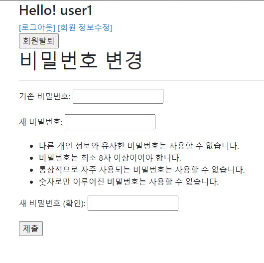

# 0917 Workshop

## 1번. Password Change

```python
## views.py
from django.shortcuts import render, redirect
from django.contrib.auth.forms import PasswordChangeForm
from django.contrib.auth.decorators import login_required


@login_required
def change_password(request):
  if request.method=='POST':
    form=PasswordChangeForm(request.user, request.POST)
    if form.is_valid():
      user = form.save()
      update_session_auth_hash(request,user)
      return redirect('articles:index')
  else:
    form=PasswordChangeForm(request.user)
  context={
    'form':form
  }
  return render(request, 'accounts/change_password.html', context)
```



