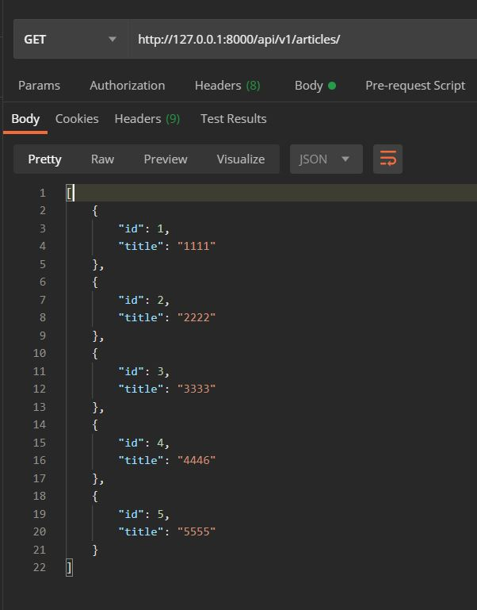
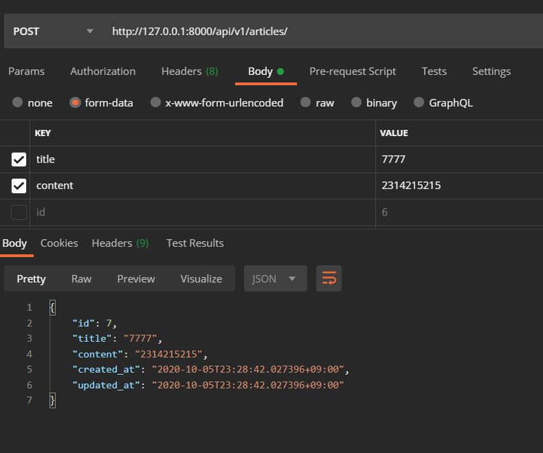
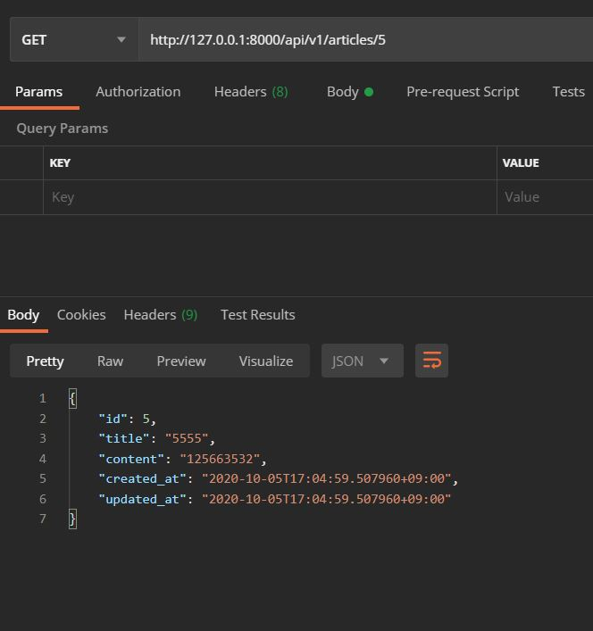
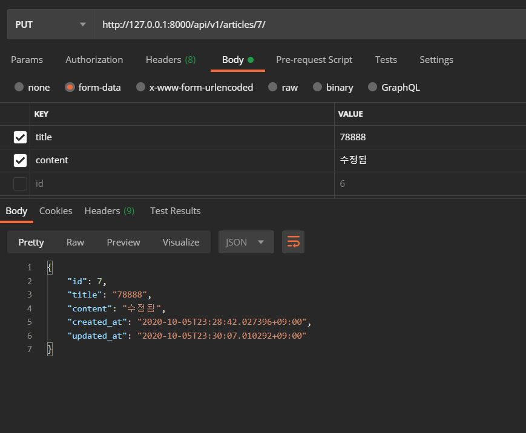
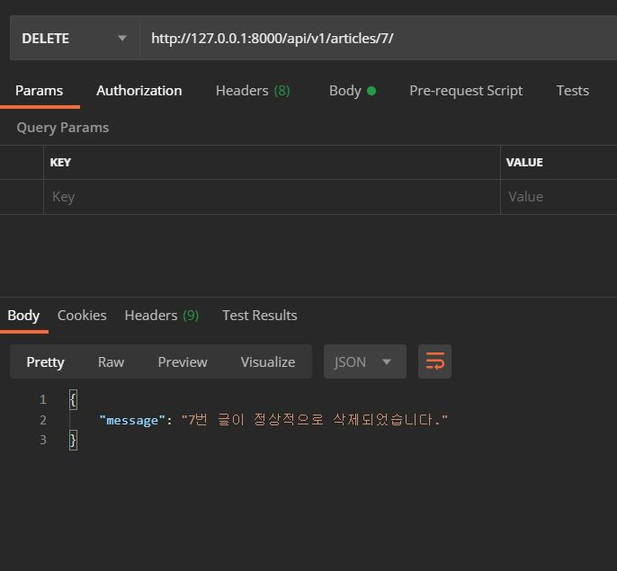

# 1005 Workshop

## views.py

```python
# 1. django core
from django.shortcuts import render, get_object_or_404
# 2. 3rd party
from rest_framework.response import Response
from rest_framework.decorators import api_view

# 3. local app
from .serializers import ArticleListSerializer, ArticleSerializer
from .models import Article


# Create your views here.
@api_view(['GET','POST',])
def article_list_create(request):
    if request.method=='GET':
        articles=Article.objects.all()
        serializer=ArticleListSerializer(articles, many=True)
    else:
        serializer=ArticleSerializer(data=request.data)
        if serializer.is_valid(raise_exception=True):
          serializer.save()
    return Response(serializer.data)


@api_view(['GET','DELETE','PUT'])
def article_detail_update_delete(request,article_pk):
  article=get_object_or_404(Article,pk=article_pk)
  if request.method=='GET':
    serializer=ArticleSerializer(article)
    return Response(serializer.data)

  elif request.method=='PUT':
    serializer=ArticleSerializer(instance=article, data=request.data)
    if serializer.is_valid(raise_exception=True):
        serializer.save()
        return Response(serializer.data)

  else:
    article.delete()
    return Response({'message':f'{article_pk}번 글이 정상적으로 삭제되었습니다.'})
```


## serializers.py

```python
from rest_framework import serializers
from .models import Article


class ArticleListSerializer(serializers.ModelSerializer):
    class Meta:
      model=Article
      fields=['id','title',]


class ArticleSerializer(serializers.ModelSerializer):
  class Meta:
    model=Article
    fields='__all__'
```


## articles list



## articles create




## articles detail



## articles update




## articles delete

