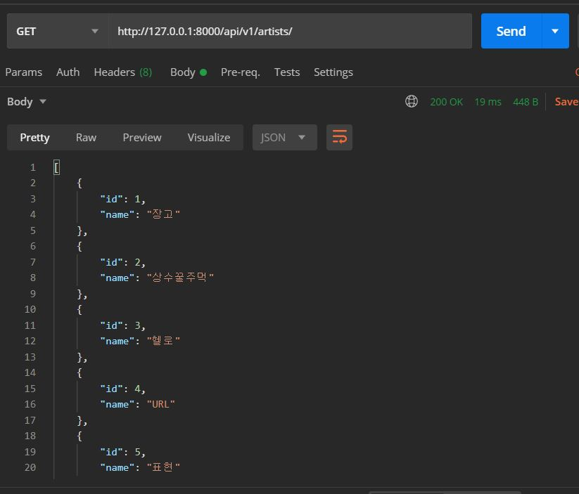

# 1006 Workshop

## views.py

```python
from django.shortcuts import render, get_object_or_404
from .models import Artist, Music
from .serializers import ArtistListSerializer, ArtistSerializer, MusicListSerializer, MusicSerializer
from rest_framework.response import Response
from rest_framework.decorators import api_view
# Create your views here.

@api_view(['POST','GET'])
def artist_list_create(request):
    if request.method=='GET':
        artists=Artist.objects.all()
        serializer=ArtistListSerializer(artists, many=True)
        return Response(serializer.data)
    else:
        serializer=ArtistSerializer(data=request.data)
        if serializer.is_valid(raise_exception=True):
            serializer.save()
            return Response(serializer.data)

@api_view(['GET',])
def artist_detail(request, artist_pk):
    artist=get_object_or_404(Artist, pk=artist_pk)
    serializer=ArtistSerializer(artist)
    return Response(serializer.data)


@api_view(['POST',])
def artist_music(request, artist_pk):
    artist=get_object_or_404(Artist,pk=artist_pk)
    serializer=MusicSerializer(data=request.data)
    if serializer.is_valid(raise_exception=True):
        serializer.save(artist=artist)
        return Response(serializer.data)


@api_view(['GET',])
def music_list(request):
    musics=Music.objects.all()
    serializer=MusicListSerializer(musics, many=True)
    return Response(serializer.data)


@api_view(['GET','PUT','DELETE'])
def music_detail_update_delete(request, music_pk):
    music=get_object_or_404(Music, pk=music_pk)
    if request.method=='GET':
        serializer=MusicSerializer(music)
        return Response(serializer.data)
    elif request.method=='PUT':
        serializer=MusicSerializer(instance=music, data=request.data)
        if serializer.is_valid(raise_exception=True):
            serializer.save()
            return Response(serializer.data)
    else:
        music.delete()
        return Response(f'message : {music_pk}번 노래가 삭제 되었습니다.')

```


## serializers.py

```python
from .models import Artist, Music
from rest_framework import serializers


class MusicSerializer(serializers.ModelSerializer):
    class Meta:
        model=Music
        fields='__all__'
        read_only_fields=['artist',]

class MusicListSerializer(serializers.ModelSerializer):
    class Meta:
        model=Music
        fields=['id','title',]
        read_only_fields=['artist',]


class ArtistSerializer(serializers.ModelSerializer):
    music_count=serializers.IntegerField(source='music_set.count', read_only=True)
    music_set=MusicSerializer(many=True, read_only=True)
    class Meta:
        model=Artist
        fields=['name','music_count','music_set',]
        read_only_fields=['music_count','music_set']


class ArtistListSerializer(serializers.ModelSerializer):
    class Meta:
        model=Artist
        fields='__all__'


```


## 응답결과

### [GET] api/v1/artists/




### [POST] api/v1/artists/


### [GET] api/v1/artists/<artist_pk>/


### [POST] api/v1/artists/<artist_pk>/music/


### [GET] api/v1/music/


### [GET] api/v1/music/<music_pk>/


### [PUT] api/v1/music/<music_pk>/


### [DELETE] api/v1/music/<music_pk>/


