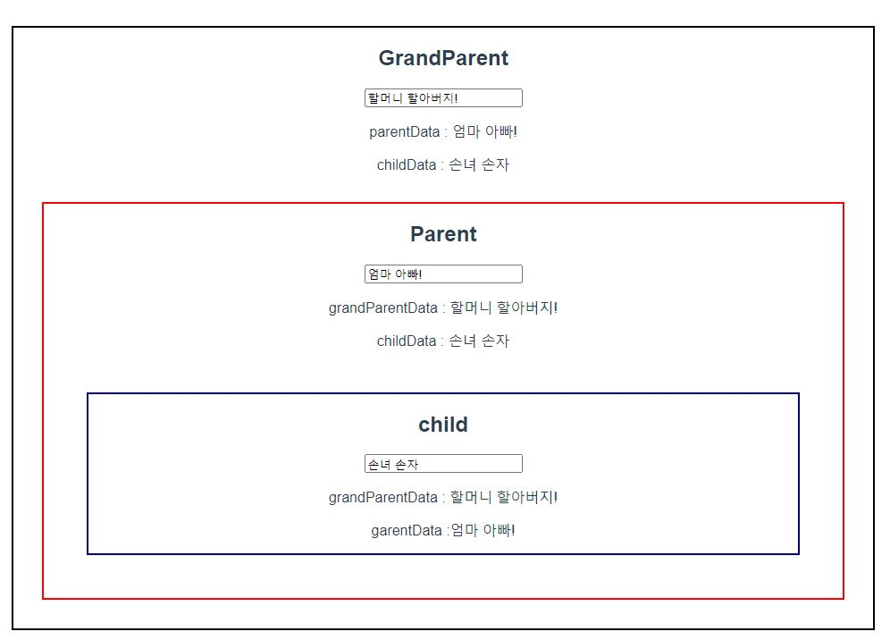

# 1111 Workshop



## App.vue

```vue
<template>
  <div id="app">
    <div id="nav">
      <router-link to="/about">About</router-link>
    </div>

    <router-view />
  </div>
</template>

<style>
#app {
  font-family: Avenir, Helvetica, Arial, sans-serif;
  -webkit-font-smoothing: antialiased;
  -moz-osx-font-smoothing: grayscale;
  text-align: center;
  color: #2c3e50;
}

#nav {
  padding: 30px;
}

#nav a {
  font-weight: bold;
  color: #2c3e50;
}

#nav a.router-link-exact-active {
  color: #42b983;
}
</style>

```


## @/components/GrandParent.vue

```vue
<template>
  <div id="grandparent">
    <h2>GrandParent</h2>
    <input v-model="grandParentData" type="text" />
    <p>parentData : {{ parentData }}</p>
    <p>childData : {{ childData }}</p>
    <Parent
      :grandParentData="grandParentData"
      @childInput="onChildInput"
      @onParentInput="onParentInput"
    />
  </div>
</template>

<script>
import Parent from "@/components/Parent.vue";
export default {
  name: "GrandParent",
  components: {
    Parent,
  },
  data: function () {
    return {
      grandParentData: "",
      childData: "",
      parentData: "",
    };
  },
  methods: {
    onChildInput: function (data) {
      this.childData = data;
    },
    onParentInput: function (data) {
      this.parentData = data;
    },
  },
};
</script>

<style>
#grandparent {
  border: 2px solid black;
  margin: 1rem;
}
</style>
```


## @/components/Parent.vue

```vue
<template>
  <div id="parent">
    <h2>Parent</h2>
    <input type="text" v-model="parentData" @input="onParentInput" />

    <p>grandParentData : {{ grandParentData }}</p>
    <p>childData : {{ childData }}</p>
    <Child
      :grandParentData="grandParentData"
      @childInput="onChildInput"
      v-bind:parentData="parentData"
    />
  </div>
</template>

<script>
import Child from "@/components/Child.vue";

export default {
  name: "Parent",
  components: {
    Child,
  },
  data: function () {
    return {
      childData: "",
      parentData: "",
    };
  },
  props: {
    grandParentData: {
      type: String,
    },
  },
  methods: {
    onChildInput: function (childData) {
      this.childData = childData;
      this.$emit("childInput", this.childData);
    },
    onParentInput: function () {
      this.$emit("onParentInput", this.parentData);
    },
  },
};
</script>

<style>
#parent {
  border: 2px solid red;
  margin: 2rem;
}
</style>
```


## @/components/Child.vue

```vue
<template>
  <div id="child">
    <h2>child</h2>
    <input v-model="childData" @input="onInput" type="text" />
    <p>grandParentData : {{ grandParentData }}</p>
    <p>garentData :{{ parentData }}</p>
  </div>
</template>

<script>
export default {
  name: "Child",
  props: {
    grandParentData: {
      type: String,
    },
    parentData: {
      type: String,
    },
  },
  data: function () {
    return {
      childData: "",
    };
  },
  methods: {
    onInput: function () {
      this.$emit("childInput", this.childData);
    },
  },
};
</script>

<style>
#child {
  border: 2px solid darkblue;
  margin: 3rem;
}
</style>
```

